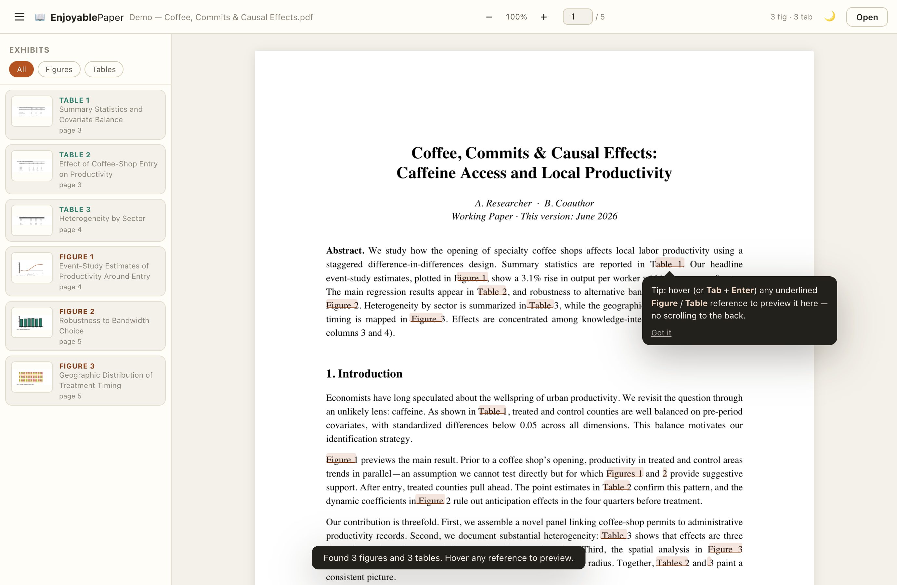

# 🍃 Hoverleaf

**Stop scrolling to the back of the PDF.**

Most economics papers — and almost every working paper — bury their figures and
tables at the very end. Reading the argument means flipping back and forth a
hundred times to find the "Table 3" the authors are talking about. It's
tiring, and it breaks your concentration.

**Hoverleaf** fixes that. Open a PDF and it reads the whole document,
finds every figure and table, and links them to the text. Now when you reach a
reference like <kbd>Figure 3</kbd> or <kbd>Table 2</kbd>, just **hover it** — the
exhibit appears right where you are. Click to pin it as a floating window so you
can keep it in view, or compare two tables side-by-side.

→ **It runs entirely in your browser. Your PDF never leaves your device.**



---

## Why it's nice to use

- **Inline previews** — hover (or keyboard <kbd>Tab</kbd> → <kbd>Enter</kbd>) any
  "Figure N" / "Table N" reference to see it instantly.
- **Pin & compare** — click a reference to float the exhibit in a draggable,
  resizable window. Open several at once to compare.
- **Exhibit rail** — a sidebar listing every figure and table with thumbnails;
  jump to any of them in one click.
- **Reads real papers** — handles two-column layouts (AER/QJE-style), em-dash
  captions (`Table 1—Title`), colon/period captions, appendix exhibits
  (`Table A1`, `Table IA.3`), figure panels (`Figure 1a`), and multi-references
  (`Tables 1–3`, `Figures 2 and 4`).
- **Private & offline** — 100% client-side. No upload, no server, no tracking.
  pdf.js is self-hosted, so it works with no network once the page has loaded.
- **Accessible** — full keyboard operation, focus management, screen-reader
  labels, reduced-motion support, light & dark themes, and touch/mobile support.

## How to use it

1. Open `index.html` (or the hosted page).
2. Drop in a PDF, choose a file, paste a PDF link, or hit **Try the live demo paper**.
3. Read. Hover any underlined reference to preview the figure or table.

You can also deep-link a PDF: `index.html?pdf=https://example.com/paper.pdf`
(the linked site must allow cross-origin access; otherwise just download and
drop the file).

### Keyboard shortcuts

| Key | Action |
| --- | --- |
| <kbd>Tab</kbd> / <kbd>Enter</kbd> | Move to a reference / pin its preview |
| <kbd>Esc</kbd> | Close floating previews |
| <kbd>F</kbd> | Toggle the exhibit sidebar |
| <kbd>D</kbd> | Toggle dark / light |
| <kbd>+</kbd> / <kbd>−</kbd> | Zoom |
| <kbd>O</kbd> | Open another paper |

## Run locally

It's a static site — any web server works (a server is needed because it loads
ES modules and a PDF worker):

```bash
# from the repo root
python3 -m http.server 8000
# then open http://localhost:8000
```

Or deploy the folder as-is to GitHub Pages / Netlify / Vercel.

## How it works

1. **Parse** — pdf.js extracts the text layer of every page with positions.
2. **Detect columns** — a gutter-detection pass groups text into one or two
   columns so two-column papers don't get scrambled.
3. **Index exhibits** — a scoring model distinguishes real captions
   ("Table 2—Effect of…") from sentences that merely mention an exhibit, and
   records where each one sits on the page.
4. **Link references** — in-text mentions are matched and transparent,
   clickable/keyboard-focusable hot-spots are laid over them.
5. **Crop & render** — when you preview an exhibit, just its region of the page
   is re-rendered (column-aware), so you see the figure or table, not the
   whole page.

No machine learning, no cloud calls — just careful geometry over the PDF.

## Limitations

- Needs a **text layer**. Scanned/image-only PDFs (no embedded text) can't be
  parsed; the app tells you when this happens.
- Caption styles vary; very unusual layouts may miss an exhibit or mis-crop one.
  The floating window is resizable and the full page is always reachable, so you
  can always get to the content.

## Tech

Vanilla JavaScript (ES modules), [pdf.js](https://mozilla.github.io/pdf.js/)
(self-hosted), no build step, no dependencies to install.

## License

MIT — free for everyone to use, host, and build on.
